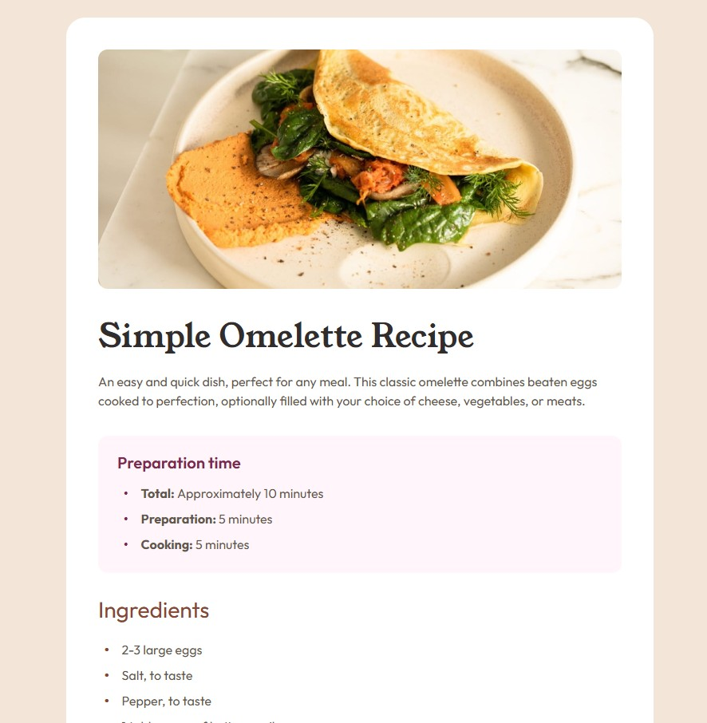

# Frontend Mentor - Recipe page solution

## Overview

This challenge was to build and deploy Frontend Mentor's Recipe page challenge.  Frontend Mentor provided various assets including the images, figma file, and style guide.

[Frontend Mentor Recipe page challenge](https://www.frontendmentor.io/challenges/recipe-page-KiTsR8QQKm)

This challenge required knowledge of css, semantic HTML, and building a responsive website.

### Screenshot

### Links

- Solution URL: [github repository](https://github.com/ClassPython/fem-recipe-page)
- Live Site URL: [github-pages](https://classpython.github.io/fem-recipe-page/)

### Built with

- Semantic HTML5 markup
- CSS properties
- Flexbox
- Mobile responsive design

### Biggest Challenge

- The biggest challenge was customizing the padding before and after each number   or bullet point to match the figma files.
- Utilizing classes and display grid for each list item allowed for customizing margins, borders, colors and fonts.

### What I learned

  

   - Resizing an image.
   - Creating ordered and unordered lists with custom padding and margins between each listed item.
   - Using custom colors, fonts, margins and padding for numbers and item description.
   - Creating a table with custom margins, padding, fonts and colors.

 

