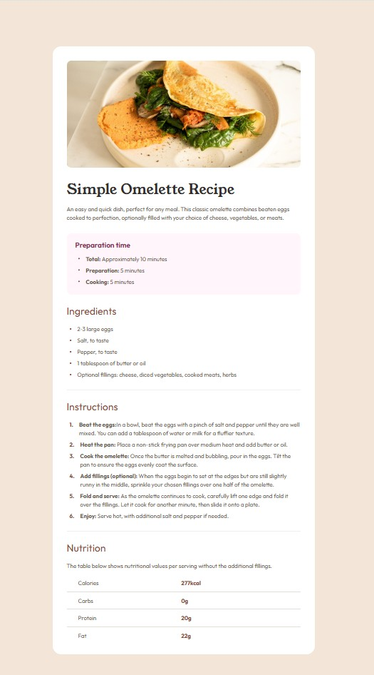

# Frontend Mentor - Recipe page solution

## Overview

This challenge was to build and deploy Frontend Mentor's Recipe page challenge.  Frontend Mentor provided various assets including the images, figma file, and style guide.

[Frontend Mentor Recipe page challenge](https://www.frontendmentor.io/challenges/recipe-page-KiTsR8QQKm)

This challenge required knowledge of css, semantic HTML, and building a responsive website.

### Screenshot

### Links

- Solution URL: [github repository](https://github.com/ClassPython/fem-recipe-page)
- Live Site URL: [github-pages](https://classpython.github.io/fem-recipe-page/)

### Built with

- Semantic HTML5 markup
- CSS properties
- Flexbox
- Mobile responsive design

### What I learned

- The biggest challenges were customizing the spacing for the ordered and unordered lists, as well as the table. 

- For the ordered list, utilizing a combination of classes, display grid, display flex, and list-style:none on the container and list items, allowed customization of margins, borders, colors, and fonts. (See instruction container section in styles.css.)

- For unordered list, utilizing before and last-of-type allowed customization of fonts, colors, paddings, and margins. (See ingredient container section in style.css)

- For the table, utilizing border-collapse, padding, and border properties, allowed for customized spacing.

 

